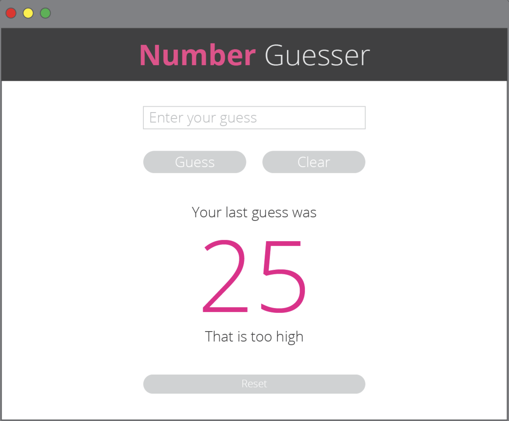
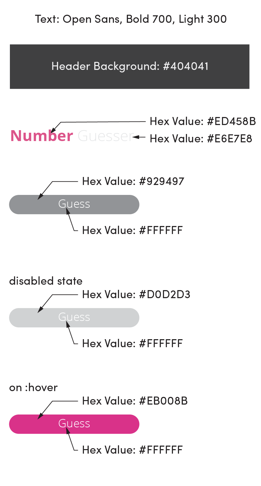
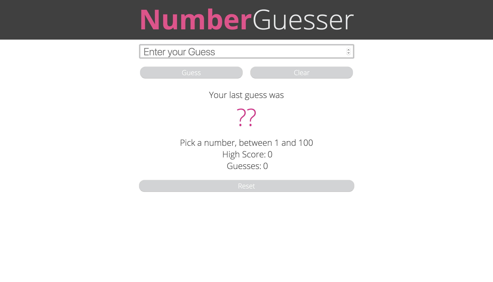
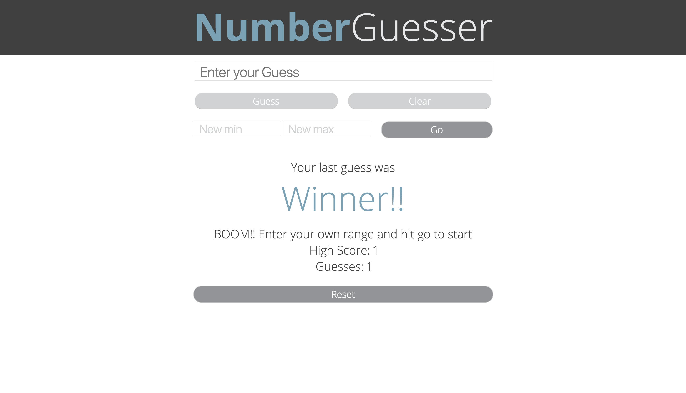

# Number Guesser
#### A Turing School Project

### Requirements

* An input field for guessing the number
* A button for submitting a guess
* A button for clearing the input field
* A button that resets the game

* Display the user’s most recent guess
* Display results and feedback:
  * If their guess is too high, it should display: “That is too high”
  * If their guess is too low, it should display: “That is too low”
  * If the guess is correct, it should display: “BOOM!”
  
* The input field should only accept numerical entries, within the defined min and max range
* The application should display an error message if the guess is not a number (e.g. parseInt() returns NaN).
* The application should display an error if the guess is outside of the range of possible answers.
* The clear button should be disabled if there is nothing to clear.
* The reset button should be disabled if there is nothing to reset.

* Add additional inputs that allow the user to specify the minimum/maximum range.
* Upon successful win, user’s range is updated:
  * Every time the user wins a round increase the maximum number by 10.
  * Every time the user wins a round decrease the minimum number by 10.

### The Comp

### Mine 

